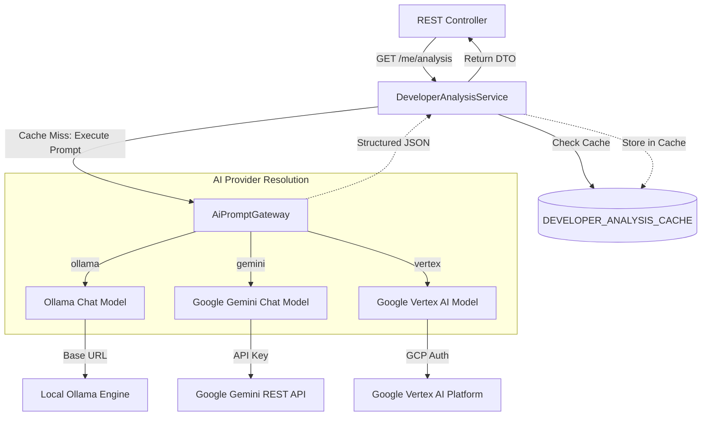

# AI Analytics & Provider Setup Guide

JiRadar includes an AI-driven developer analysis module that synthesizes raw operational metrics (such as cycle time, review volume, throughput, and ping-pong review rates) into qualitative coaching insights, performance scores, and personalized growth plans.

---

## 1. Architecture Overview

The AI subsystem leverages Spring AI abstractions via the `AiPromptGateway` to decouple prompt execution from specific LLM vendors. The feature is managed behind a feature flag and caches analysis results to control quota consumption.



---

## 2. Managed AI Providers

JiRadar supports three LLM providers out of the box:

| Provider Key | Spring Configuration Class | Target Engine / Model Default | Connection Prerequisites |
| :--- | :--- | :--- | :--- |
| **`ollama`** | `OllamaAiConfig` | `ollama-1.0` (e.g., `llama3.1`) | Local or hosted Ollama endpoint URL. |
| **`gemini`** | `GeminiAiConfig` | `gemini-1.5-pro` | Google Gemini API Key. |
| **`vertex`** | `VertexAiConfig` | `gemini-1.5-pro` | GCP Project ID, Location, and Application Default Credentials. |

---

## 3. Configuration & Feature Flags

The AI feature flag is **disabled by default**. You must enable the flag and specify an active AI provider via application properties or environment variables.

### Feature Flag Configuration

```yaml
jiradar:
  feature:
    flags:
      ai-analysis:
        enabled: ${JIRADAR_FEATURE_FLAGS_AI_ANALYSIS_ENABLED:true}
  ai:
    provider: ${JIRADAR_AI_PROVIDER:ollama} # Options: ollama, gemini, vertex, none
```

### Provider-Specific Environment Variables

#### 1. Ollama (Local / Docker)
```bash
export JIRADAR_FEATURE_FLAGS_AI_ANALYSIS_ENABLED=true
export JIRADAR_AI_PROVIDER=ollama
export OLLAMA_BASE_URL=http://localhost:11434
export OLLAMA_MODEL_NAME=llama3.1
```

#### 2. Google Gemini
```bash
export JIRADAR_FEATURE_FLAGS_AI_ANALYSIS_ENABLED=true
export JIRADAR_AI_PROVIDER=gemini
export GEMINI_API_KEY=your-gemini-api-key
export GEMINI_MODEL_NAME=gemini-1.5-pro
```

#### 3. Google Vertex AI (GCP)
```bash
export JIRADAR_FEATURE_FLAGS_AI_ANALYSIS_ENABLED=true
export JIRADAR_AI_PROVIDER=vertex
export GCP_PROJECT_ID=your-gcp-project-id
export GCP_LOCATION=europe-west1
export GCP_MODEL_NAME=gemini-1.5-pro
```

---

## 4. How to Add a New AI Provider

To integrate a new LLM provider (for example, OpenAI or Anthropic):

### Step 1: Create Properties Configuration Class

Define a property configuration class extending `AiProperties` in package `infrastructure/ai/provider/<your_provider>`:

```java
package com.jiradar.jiradarback.infrastructure.ai.provider.openai;

import com.jiradar.jiradarback.infrastructure.ai.common.properties.AiProperties;
import lombok.Getter;
import org.springframework.boot.context.properties.ConfigurationProperties;
import org.springframework.boot.context.properties.bind.ConstructorBinding;

@Getter
@ConfigurationProperties(prefix = "jiradar.ai.openai")
public class OpenAiProperties extends AiProperties {

    private final String apiKey;

    @ConstructorBinding
    public OpenAiProperties(String modelName, String apiKey) {
        super(modelName);
        this.apiKey = apiKey;
    }
}
```

### Step 2: Create Provider Bean Configuration

Implement the Spring AI `ChatClient` bean conditional on `jiradar.ai.provider`:

```java
package com.jiradar.jiradarback.infrastructure.ai.provider.openai;

import lombok.RequiredArgsConstructor;
import org.springframework.ai.chat.client.ChatClient;
import org.springframework.ai.chat.model.ChatModel;
import org.springframework.ai.openai.OpenAiChatModel;
import org.springframework.ai.openai.OpenAiChatOptions;
import org.springframework.ai.openai.api.OpenAiApi;
import org.springframework.boot.autoconfigure.condition.ConditionalOnProperty;
import org.springframework.boot.context.properties.EnableConfigurationProperties;
import org.springframework.context.annotation.Bean;
import org.springframework.context.annotation.Configuration;

@Configuration
@ConditionalOnProperty(name = "jiradar.ai.provider", havingValue = "openai")
@EnableConfigurationProperties(OpenAiProperties.class)
@RequiredArgsConstructor
public class OpenAiAiConfig {

    private final OpenAiProperties openAiProperties;

    @Bean
    public ChatClient openAiChatClient() {
        OpenAiApi openAiApi = new OpenAiApi(openAiProperties.getApiKey());

        ChatModel chatModel = OpenAiChatModel.builder()
                .openAiApi(openAiApi)
                .defaultOptions(OpenAiChatOptions.builder()
                        .model(openAiProperties.getModelName())
                        .temperature(0.0)
                        .build())
                .build();

        return ChatClient.create(chatModel);
    }
}
```

### Step 3: Register Application Properties

Declare the default properties in `application.yaml`:

```yaml
jiradar:
  ai:
    provider: ${JIRADAR_AI_PROVIDER:none}
    openai:
      api-key: ${OPENAI_API_KEY:}
      model-name: ${OPENAI_MODEL_NAME:gpt-4o}
```

### Step 4: Update Startup Banner Context

Update `BannerConfig.java` in `infrastructure/common/config` to log connection details for your new provider during application startup:

```java
case "openai" -> out.println("      └── Auth Mode    : Direct OpenAI API Key");
```

### Step 5: Add Unit & Integration Tests

Create a test class under `src/test/java/com/jiradar/jiradarback/infrastructure/ai/` to verify configuration property binding:

```java
@Test
void shouldBindOpenAiPropertiesCorrectly() {
    OpenAiProperties props = new OpenAiProperties("gpt-4o", "secret-key");
    assertEquals("gpt-4o", props.getModelName());
    assertEquals("secret-key", props.getApiKey());
}
```

---

## 5. Local Docker Execution (Ollama Stack)

JiRadar provides a pre-configured Docker Compose file to run Ollama and inject local GGUF models:

```bash
# Launch Ollama container stack
docker compose -f docker/ai/docker-compose-ollama.yaml up -d

# Inject and register a model file into the local Ollama instance
./docker/ai/inject_model.sh --file /path/to/model.gguf --model llama3.1
```