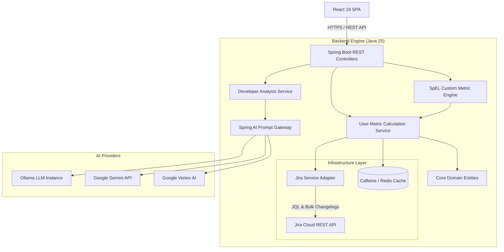
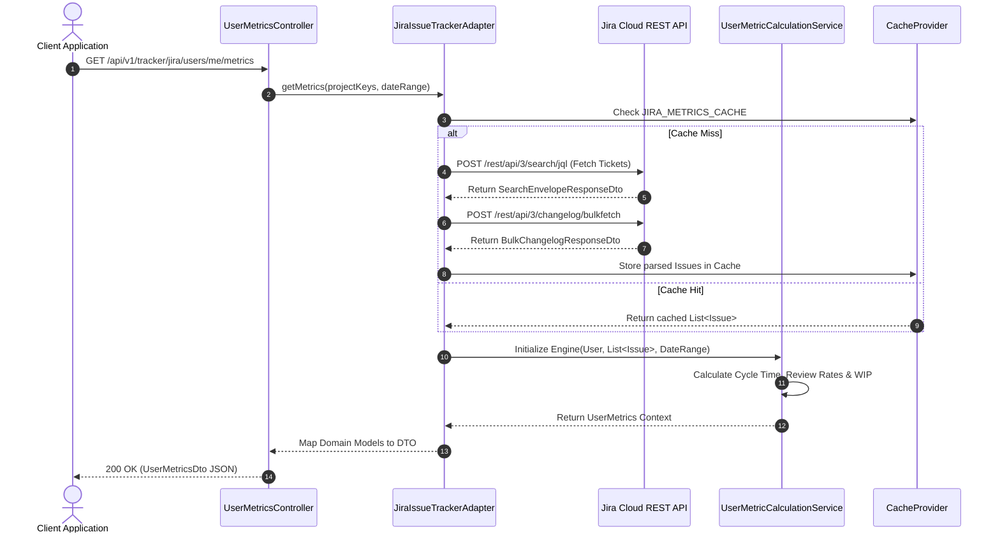
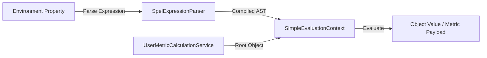
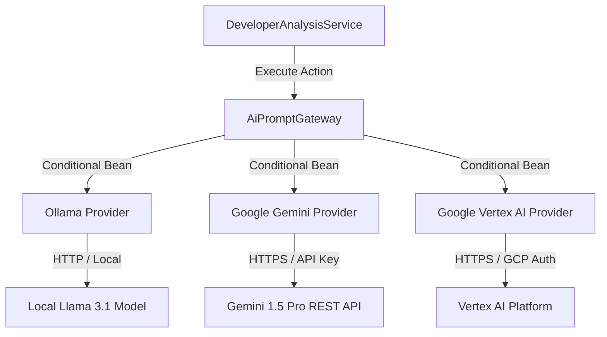

# Technical Architecture & System Blueprint

## 1. Architectural Overview

JiRadar is constructed as a decoupled, multi-module system composed of a Spring Boot backend service and a React front-end application. The platform connects to issue-tracking tools (such as Jira) via
REST APIs, extracts changelog event streams, processes time-series transitions, and computes software engineering metrics.



---

## 2. Core Modules & Layering Strategy

The repository follows a clean architecture pattern to decouple business calculation logic from infrastructure providers and HTTP endpoints.

```text
JiRadar
├── back-end/
│   └── src/main/java/com/jiradar/jiradarback/
│       ├── controller/        # REST Endpoints, DTOs, and Request Filters
│       ├── core/              # Business Domain Models, Services, and Factories
│       ├── exception/         # Application Business Exceptions
│       └── infrastructure/   # Issue Tracker Adapters, Cache Providers, AI Engines
└── front-end/
    └── src/
        ├── core/              # API Clients, Context Providers, Shared Hooks
        └── features/          # Domain Visualizations, Charts, and Dashboards
```

### Domain Layer (`core`)

Contains domain models (`Issue`, `User`, `ChangeLog`, `UserMetrics`) and pure calculation logic. It operates independently of HTTP frameworks or specific database schemas.

### Infrastructure Layer (`infrastructure`)

Houses integration logic for third-party REST services. The `JiraIssueTrackerAdapter` maps external Jira JSON response payloads into internal domain models. Cache strategies (Caffeine in-memory vs.
Redis distributed caching) are encapsulated here.

### Presentation Layer (`controller`)

Exposes versioned REST resources under `/api/v1/tracker/{issueTracker}/...`. Includes servlet filters to convert snake_case HTTP query parameters into Java camelCase bindings transparently.

---

## 3. Core Component Interactions



---

## 4. Subsystem Deep-Dive

### 4.1. SpEL Dynamic Metric Engine

The `CustomMetricEngine` allows teams to evaluate dynamic formulas declared in environment variables against the `UserMetricCalculationService` context.



* **Compilation**: Expressions are compiled once at application startup to reduce runtime CPU overhead.
* **Security**: Executed within `SimpleEvaluationContext.forReadOnlyDataBinding()`, restricting access to instance method invocations and property reading without modifying application state.

### 4.2. Caching Infrastructure

JiRadar uses a pluggable `CacheProvider` strategy controlled via application properties.

```yaml
jiradar:
  cache:
    enabled: true
    provider: caffeine # Options: caffeine, redis, none
    specs:
      JIRA_METRICS_CACHE:
        ttl: 15m
        maxSize: 1000
      JIRA_USER_CACHE:
        ttl: 2h
        maxSize: 200
```

* **Caffeine**: Local in-memory caching for single-instance setups.
* **Redis**: Distributed key-value store support using standard JSON serialization for multi-replica horizontal deployments.

### 4.3. Multi-Provider AI Integration Gateway

The `AiPromptGateway` uses Spring AI to route prompt evaluations to local or cloud LLMs.



---

## 5. Technology Matrix

| System Component            | Technology / Library      | Version / Specifications                          |
|:----------------------------|:--------------------------|:--------------------------------------------------|
| **Runtime Environment**     | OpenJDK / Temurin         | Java 25                                           |
| **Backend Framework**       | Spring Boot               | 4.1.0                                             |
| **AI Abstraction**          | Spring AI Client          | 2.0.0                                             |
| **UI Framework**            | React                     | 19.x                                              |
| **Build Engine (Frontend)** | Vite                      | 6.x                                               |
| **Styling Engine**          | Tailwind CSS              | v4                                                |
| **In-Memory Cache**         | Caffeine                  | 3.x                                               |
| **Distributed Cache**       | Redis / Valkey            | Spring Data Redis Integration                     |
| **API Documentation**       | SpringDoc OpenAPI         | OpenAPI 3.0 / Swagger UI                          |
| **Backend Testing**         | JUnit 5, Cucumber, JaCoCo | BDD-driven behavioral verification                |
| **Frontend Testing**        | Vitest, Testing Library   | JSDOM environment, minimum 80% coverage threshold |