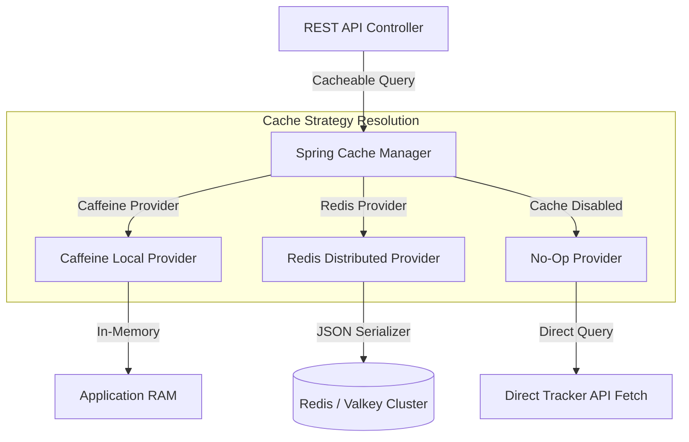
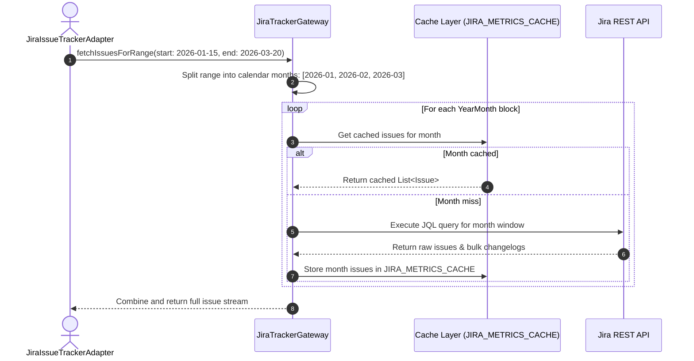

# Caching Strategy & Configuration Guide

JiRadar incorporates a pluggable, multi-level caching layer designed to eliminate redundant HTTP round-trips to external issue trackers, speed up complex SpEL metric calculations, and manage AI prompt
quotas.

---

## 1. Architecture & Provider Overview

The application abstracts caching mechanisms through the `CacheProvider` interface contract. Based on environment settings, the application dynamically registers one of three available strategies
during bootstrap.



### Available Cache Providers

* **Caffeine (`caffeine`)**: Default local in-memory caching provider. Designed for single-instance deployments requiring high read speeds with minimal memory usage.
* **Redis (`redis`)**: Externalized distributed caching provider using JSON-serialized payloads via `RedisTemplate`. Designed for multi-replica, horizontally scaled cloud deployments.
* **No-Op (`none`)**: Activated when caching is explicitly disabled (`jiradar.cache.enabled=false`). All telemetry and user queries pass through directly to live issue tracker APIs.

---

## 2. Managed Cache Regions & Specifications

JiRadar partitions data into four distinct cache contexts, each tuned with custom retention periods (TTL) and maximum capacity bounds.

| Cache Region Name              | Configuration Key    | Default TTL | Default Max Size | Data Payload Context                                                |
|:-------------------------------|:---------------------|:------------|:-----------------|:--------------------------------------------------------------------|
| **`JIRA_METRICS_CACHE`**       | `JIRA_METRICS`       | 15 Minutes  | 1000 Entries     | Issues and bulk changelogs grouped by month or custom date windows. |
| **`JIRA_ISSUE_CACHE`**         | `JIRA_ISSUE`         | 5 Minutes   | 500 Entries      | Raw issue details fetched via individual key lookup.                |
| **`JIRA_USER_CACHE`**          | `JIRA_USER`          | 2 Hours     | 200 Entries      | Authenticated user profile metadata and credential configurations.  |
| **`DEVELOPER_ANALYSIS_CACHE`** | `DEVELOPER_ANALYSIS` | 30 Minutes  | 200 Entries      | AI-generated developer analysis results to prevent quota overuse.   |

---

## 3. Intelligent Query Partitioning Strategy

To keep cache hit ratios high when querying broad date ranges (e.g., fetching a full year of developer metrics), JiRadar dynamically splits request windows into complete calendar months (`YearMonth`).



By grouping data into immutable historic month chunks, past activity data stays persistently cached while only the active month requires refresh cycles.

---

## 4. Configuration Properties Reference

Cache properties are configured within `application.yaml` or overridden via environment variables.

### Environment Variable Overrides

| Environment Variable          | Default Value | Description                                             |
|:------------------------------|:--------------|:--------------------------------------------------------|
| `CACHE_ENABLED`               | `true`        | Enables or disables the application caching layer.      |
| `CACHE_PROVIDER`              | `caffeine`    | Target cache provider strategy (`caffeine` or `redis`). |
| `SPRING_DATA_REDIS_HOST`      | `localhost`   | Redis server hostname (used in `redis` mode).           |
| `SPRING_DATA_REDIS_PORT`      | `6379`        | Redis server port (used in `redis` mode).               |
| `SPRING_DATA_REDIS_PASSWORD`  | *(empty)*     | Optional Redis connection password.                     |
| `JIRA_METRICS_CACHE_TTL`      | `15m`         | Time-to-live duration for metrics cache entries.        |
| `JIRA_METRICS_CACHE_MAX_SIZE` | `1000`        | Maximum entry count for local Caffeine metrics cache.   |
| `JIRA_USER_CACHE_TTL`         | `2h`          | Time-to-live duration for user profile cache.           |
| `JIRA_USER_CACHE_MAX_SIZE`    | `200`         | Maximum entry count for user profile cache.             |

### Application YAML Configuration Example

```yaml
jiradar:
  cache:
    enabled: ${CACHE_ENABLED:true}
    provider: ${CACHE_PROVIDER:caffeine}
    specs:
      JIRA_METRICS_CACHE:
        ttl: ${JIRA_METRICS_CACHE_TTL:15m}
        maxSize: ${JIRA_METRICS_CACHE_MAX_SIZE:1000}
      JIRA_ISSUE_CACHE:
        ttl: 5m
        maxSize: 500
      JIRA_USER_CACHE:
        ttl: ${JIRA_USER_CACHE_TTL:2h}
        maxSize: ${JIRA_USER_CACHE_MAX_SIZE:200}
      DEVELOPER_ANALYSIS_CACHE:
        ttl: 30m
        maxSize: 200
```

---

## 5. Adding a New Cache Provider

To extend JiRadar with a new caching engine (e.g., Hazelcast, Memcached, Ehcache):

1. **Implement `CacheProvider`**: Create a class under `infrastructure/cache/strategy` implementing `CacheProvider`.
2. **Conditional Bean Registration**: Annotate the class with `@ConditionalOnProperty(name = "jiradar.cache.provider", havingValue = "your-provider-name")`.
3. **Map Cache Configurations**: Use `CacheProperties` inside `buildCacheManager()` to bind TTL and size thresholds dynamically across all regions in `AvailableCache`.

```java
package com.jiradar.jiradarback.infrastructure.cache.strategy;

import com.jiradar.jiradarback.infrastructure.cache.CacheProvider;
import com.jiradar.jiradarback.infrastructure.cache.config.AvailableCache;
import com.jiradar.jiradarback.infrastructure.cache.config.CacheProperties;
import lombok.RequiredArgsConstructor;
import org.springframework.boot.autoconfigure.condition.ConditionalOnProperty;
import org.springframework.cache.CacheManager;
import org.springframework.stereotype.Component;

@Component
@RequiredArgsConstructor
@ConditionalOnProperty(name = "jiradar.cache.provider", havingValue = "custom-provider")
@ConditionalOnProperty(name = "jiradar.cache.enabled", havingValue = "true", matchIfMissing = true)
public class CustomCacheProvider implements CacheProvider {

	private final CacheProperties cacheProperties;

	@Override
	public String getName() {
		return "custom-provider";
	}

	@Override
	public CacheManager buildCacheManager() {
		// Instantiate and configure your custom Spring CacheManager instance
		return new CustomCacheManager();
	}
}
```

---

## 6. Infrastructure Deployment

To execute JiRadar using external caching infrastructure, run the pre-configured Valkey/Redis Compose stack:

```bash
# Start Valkey (Redis-compatible) cache service alongside RedisInsight visualizer
docker compose -f docker/caching/docker-compose-redis.yaml up -d
```

To run the complete system stack with Redis caching activated:

```bash
export CACHE_PROVIDER=redis
export SPRING_DATA_REDIS_HOST=valkey
docker compose -f docker/docker-compose-app.yaml up -d
```