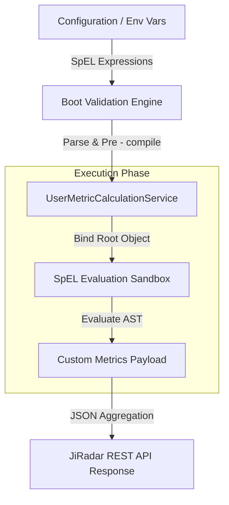

# JiRadar Custom Metrics Configuration Guide

JiRadar incorporates a dynamic custom metrics engine powered by **Spring Expression Language (SpEL)**. This engine allows engineering leaders and agile coaches to define custom key performance
indicators (KPIs) via configuration properties or environment variables without modifying source code or recompiling the application.

---

## Architecture & How It Works

Custom metrics are defined as key-value pairs where the key represents the metric identifier and the value contains a SpEL expression. During execution, JiRadar evaluates these expressions against the
`UserMetricCalculationService` context, exposing calculated metrics alongside core delivery telemetry.



### Safety and Performance Features

1. **Fail-Fast Initialization**: During application bootstrap (`@PostConstruct`), JiRadar runs every defined SpEL expression against a mock data context. If an expression contains syntax errors or
   invalid references, the system immediately throws an initialization exception and prevents bad configurations from reaching production.
2. **Read-Only Data Binding**: Expressions are evaluated using a restricted `SimpleEvaluationContext` configured strictly for read-only data binding. This prevents formulas from modifying underlying
   domain states or accessing non-whitelisted Java system types.
3. **AST Pre-Compilation**: Formulas are parsed once at startup. When breaking down historical metrics by weekly, monthly, or yearly granularities, pre-compiled abstract syntax trees (ASTs) are reused
   across intervals to ensure minimal CPU overhead.
4. **Isolated Runtime Error Handling**: If an expression encounters an operational division-by-zero or evaluation exception on a specific date slice, the engine catches the failure locally and returns
   an error payload without causing the entire REST response to fail.

---

## Evaluation Context Reference

Expressions execute against the `UserMetricCalculationService` context, which provides direct access to counters, duration metrics, utility methods, and raw issue collections.

### 1. Context Properties & Counters

| Property / Field Name    | Data Type   | Description                                                           |
|:-------------------------|:------------|:----------------------------------------------------------------------|
| `startedCount`           | `long`      | Number of user issues moved to an active status during the timeframe. |
| `numberOfIssueStarted`   | `long`      | Alias getter for `startedCount`.                                      |
| `doneCount`              | `long`      | Number of user issues transitioned to completed during the timeframe. |
| `numberOfIssueDone`      | `long`      | Alias getter for `doneCount`.                                         |
| `reopenedCount`          | `long`      | Total review reopen transitions triggered on user tasks.              |
| `numberOfReviewReopened` | `long`      | Alias getter for `reopenedCount`.                                     |
| `startedAndDoneCount`    | `long`      | Issues both started and completed within the selected timeframe.      |
| `numberOfReviewDone`     | `long`      | Count of peer code reviews completed by the active user.              |
| `range`                  | `DateRange` | Timeframe boundaries containing `from()` and `to()` dates.            |

### 2. Algorithmic Context Methods

| Method                                   | Return Type           | Description                                                    |
|:-----------------------------------------|:----------------------|:---------------------------------------------------------------|
| `calculateAverageCycleTime()`            | `Duration`            | Average time spent resolving issues from start to done.        |
| `calculateAverageReviewTime()`           | `Duration`            | Average time spent reviewing peer pull requests/issues.        |
| `calculateTeamReviewParticipationRate()` | `double`              | User review participation rate relative to total team reviews. |
| `calculateDeliverySuccessRate()`         | `double`              | Completion success rate of started tasks.                      |
| `calculatePingPongReviewRate()`          | `double`              | Code review back-and-forth rate (reopens vs. done).            |
| `calculateParallelJiraInProgressRate()`  | `double`              | Daily average work-in-progress (WIP) index.                    |
| `getDoneIssuesTypeDistribution()`        | `Map<String, Double>` | Percentage breakdown of completed tasks by issue type.         |

### 3. Collection Selection and Filtering

You can query collections using SpEL collection selection (`.?[condition]`) and projection (`.![property]`):

* `userIssues` (`List<Issue>`): Issues assigned to the active user.
* `devReviewDurations` (`List<Duration>`): Review durations performed specifically by the active user.
* `teamReviewDurations` (`List<Duration>`): Review durations across the entire team.

When filtering the `userIssues` collection, individual `Issue` objects expose:

* `key` (`String`): Issue key (e.g., `PROJ-123`).
* `type.name` (`String`): Issue type name (e.g., `Bug`, `Story`, `Task`).
* `status.name` (`String`): Current status name (e.g., `In Progress`, `Done`).

---

## Configuration Setup

Custom metrics are configured using environment variables under the `issue-tracker.metrics.custom-metrics` prefix.

```text
ISSUE_TRACKER_METRICS_CUSTOM_METRICS_0_NAME=total-assigned
ISSUE_TRACKER_METRICS_CUSTOM_METRICS_0_FORMULA=userIssues.size()
ISSUE_TRACKER_METRICS_CUSTOM_METRICS_1_NAME=bugs-count
ISSUE_TRACKER_METRICS_CUSTOM_METRICS_1_FORMULA=userIssues.?[type.name == 'Bug'].size()
ISSUE_TRACKER_METRICS_CUSTOM_METRICS_2_NAME=completion-rate
ISSUE_TRACKER_METRICS_CUSTOM_METRICS_2_FORMULA=numberOfIssueStarted > 0 ? (numberOfIssueDone * 100.0 / numberOfIssueStarted) : 0.0
ISSUE_TRACKER_METRICS_CUSTOM_METRICS_3_NAME=wip-alert
ISSUE_TRACKER_METRICS_CUSTOM_METRICS_3_FORMULA=calculateParallelJiraInProgressRate() > 4.0
```

---

## Example Formulas

### Total Assigned Issues

```groovy
userIssues.size()
```

### Total Bugs Count

```groovy
userIssues.? [type.name == 'Bug'].size()
```

### Completed Stories Count

```groovy
userIssues.? [type.name == 'Story' && status.name == 'Done'].size()
```

### Delivery Completion Rate Percentage

```groovy
numberOfIssueStarted > 0 ? (numberOfIssueDone * 100.0 / numberOfIssueStarted) : 0.0
```

### Clean Delivery Rate (Without Reopens)

```groovy
numberOfIssueDone > 0 ? ((numberOfIssueDone - numberOfReviewReopened) * 100.0 / numberOfIssueDone) : 0.0
```

### High WIP Alert Flag

```groovy
calculateParallelJiraInProgressRate() > 4.0
```