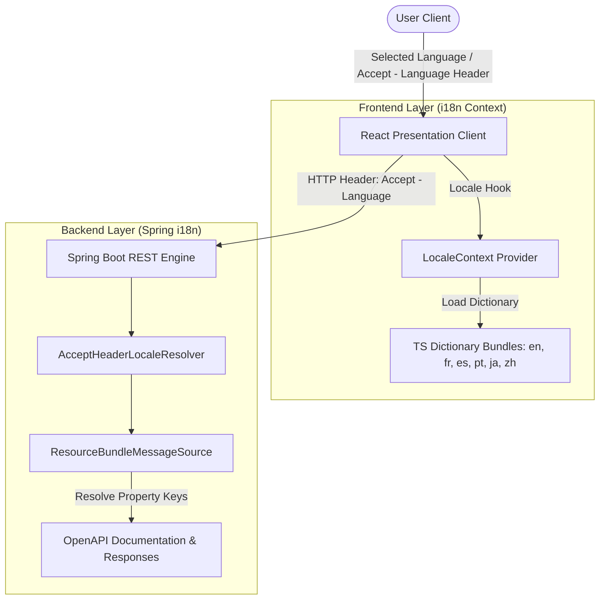

# Internationalization (i18n) & Localization Setup

JiRadar features full internationalization support across both the Spring Boot backend REST services and the React frontend presentation client. This architecture allows seamless language switching
for API documentation, localized openapi error messages, and UI dashboard elements.

---

## 1. Supported Languages

JiRadar currently provides native support for 6 languages:

| Language                | ISO Code | Backend Support | Frontend Bundle |
|:------------------------|:---------|:----------------|:----------------|
| **English** *(Default)* | `en`     | Yes             | Yes             |
| **French**              | `fr`     | Yes             | Yes             |
| **Spanish**             | `es`     | Yes             | Yes             |
| **Portuguese**          | `pt`     | Yes             | Yes             |
| **Japanese**            | `ja`     | Yes             | Yes             |
| **Chinese**             | `zh`     | Yes             | Yes             |

---

## 2. System Architecture

Internationalization is handled dynamically across both architectural layers:



### Backend Layer (Spring Boot)

- **Locale Resolution**: Uses `AcceptHeaderLocaleResolver` to inspect incoming HTTP `Accept-Language` headers. English is configured as the fallback default locale.
- **Message Bundle Resolution**: Uses `ResourceBundleMessageSource` configured to scan property files under `i18n/openapi/openapi*.properties`.
- **OpenAPI Translation**: An `OpenApiCustomizer` dynamically translates OpenAPI tags, operational summaries, parameters, and DTO schema descriptions according to the user's locale.

### Frontend Layer (React 19)

- **Locale Context**: Manages state via `LocaleProvider` and persists user language preferences in cookies.
- **Translation Engine**: Custom hooks (`useTranslation` and `useLocale`) dynamically map translation keys to localized TypeScript key-value maps located in `core/constants/locales/`.

---

## 3. How to Add a New Language

Follow these steps to add support for a new language (e.g., German - `de`).

### Step 1: Add Backend Properties File

Create a new properties file under `back-end/src/main/resources/i18n/openapi/`:

`openapi_de.properties`:

```properties
openapi.info.title=Jiradar Backend API
openapi.info.description=REST-API zur Erfassung von Metriken und Verlaufs-Logs aus Issue-Tracking-Systemen.
openapi.endpoint.user.tag.description=Endpunkte zum Abrufen von Benutzerprofilen, Metriken und Verlaufs-Logs.
openapi.endpoint.user.param.tracker=Der Bezeichner des Issue-Tracker-Anbieters (z. B. jira, gitlab).
openapi.endpoint.user.me.summary=Authentifizierten Benutzer abrufen
openapi.endpoint.user.me.description=Gibt das vollständige Profil des aktuell authentifizierten Benutzers zurück.
```

### Step 2: Register Locale in Backend Strategy

Update `LanguageConfig.java` in `core/config/` to register the new supported locale:

```java

@Bean
public LocaleResolver localeResolver() {
	AcceptHeaderLocaleResolver localeResolver = new AcceptHeaderLocaleResolver();
	localeResolver.setDefaultLocale(Locale.ENGLISH);
	localeResolver.setSupportedLocales(Arrays.asList(
			Locale.ENGLISH,
			Locale.FRENCH,
			Locale.JAPANESE,
			Locale.CHINESE,
			Locale.forLanguageTag("es"),
			Locale.forLanguageTag("pt"),
			Locale.forLanguageTag("de") // Add new language tag here
	));
	return localeResolver;
}
```

### Step 3: Add Frontend Translation Bundle

Create a new dictionary file under `front-end/src/core/constants/locales/de.ts`:

```typescript
export const de = {
    common: {
        loading: 'Laden...',
        error: 'Ein Fehler ist aufgetreten',
    },
    dashboard: {
        title: 'Entwickler-Leistungs-Dashboard',
        filterProject: 'Projekte auswählen',
    },
    // Add matching domain translations
};
```

Export the new locale in `front-end/src/core/constants/locales/index.ts`:

```typescript
import {en} from './en';
import {fr} from './fr';
import {de} from './de';

export const locales = {
    en,
    fr,
    de,
};

export type SupportedLocales = keyof typeof locales;
```

### Step 4: Register New Locale in Frontend Switcher

Update the `LanguageSwitcher` component to enable users to select the new language from the navigation bar menu.

---

## 4. Verification & Testing

Validate your new language implementation:

1. **Backend Integration**: Execute a localized request against the Swagger/OpenAPI documentation endpoint:
   ```bash
   curl -H "Accept-Language: de" http://localhost:8080/v3/api-docs
   ```
2. **Frontend Validation**: Run the Vitest unit tests to ensure translation dictionaries load without missing key gaps:
   ```bash
   cd front-end
   npm run test
   ```