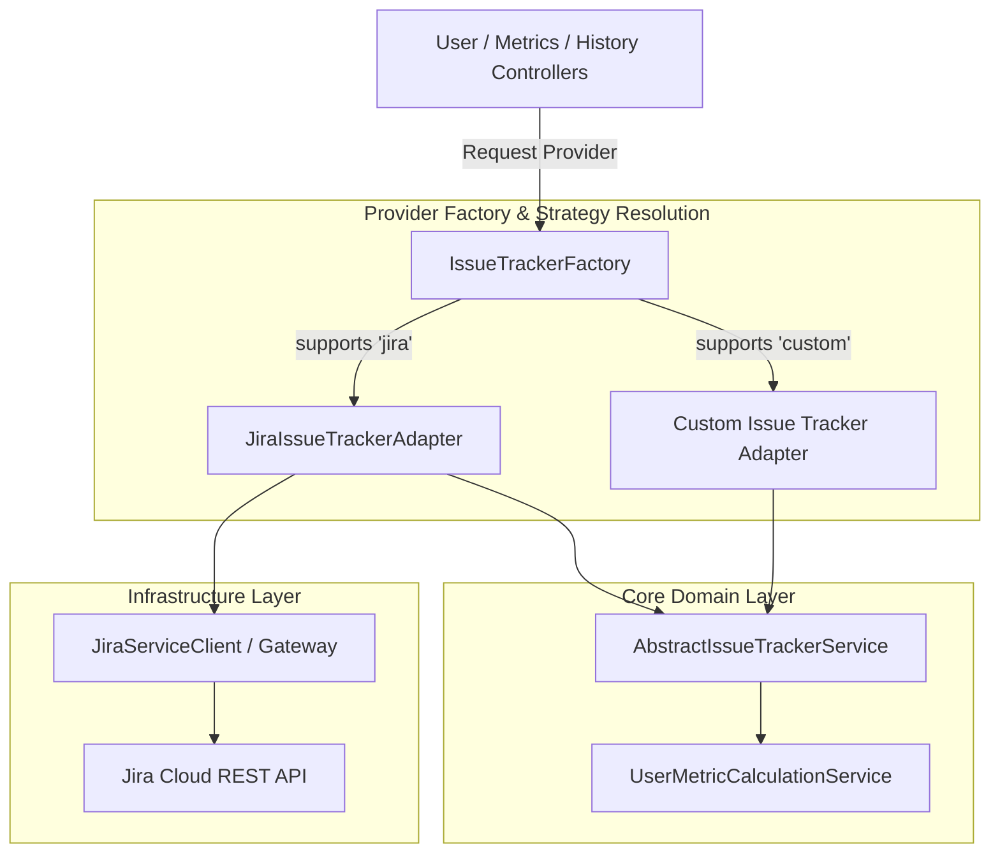

# Issue Tracker Provider Architecture & Extension Guide

JiRadar features a modular provider strategy that abstracts issue-tracking platforms (such as Jira) behind domain contracts. This document details how issue trackers are structured, handled, and
extended within the system.

---

## 1. Architectural Overview

The backend uses an abstract service layer to isolate domain logic and telemetry calculations from vendor-specific REST API schemas and JQL queries.



---

## 2. Core Provider Abstraction Contract

Every issue tracking provider extends `AbstractIssueTrackerService` and registers as a Spring service bean.

### Core Lifecycle Methods

| Method Signature                                                                    | Return Type              | Description                                                                       |
|:------------------------------------------------------------------------------------|:-------------------------|:----------------------------------------------------------------------------------|
| `supports(String provider)`                                                         | `boolean`                | Asserts whether the adapter handles the requested provider name (e.g., `"jira"`). |
| `getMyself()`                                                                       | `User`                   | Fetches profile metadata for the authenticated account context.                   |
| `getIssueByKey(String issueKey)`                                                    | `Optional<Issue>`        | Retrieves a single issue domain model populated with changelog history.           |
| `getMetrics(ProjectSearchParamCommand command)`                                     | `UserMetrics`            | Calculates aggregated metrics across a target date range and project list.        |
| `getMetrics(ProjectSearchParamCommand command, TimeGranularity historyGranularity)` | `UserMetrics`            | Computes time-segmented activity telemetry (e.g., daily, weekly, monthly).        |
| `getHistory(ProjectSearchParamCommand command, Pageable pageable)`                  | `Page<UserHistoryEvent>` | Returns a paginated stream of status transition events and review actions.        |

---

## 3. Dynamic Module Disabling Strategy

JiRadar incorporates a `ModuleDisablerPostProcessor` that inspects Spring environment properties during application bootstrap. If an issue tracker integration is set to `enabled: false`, its related
beans are unregistered from the Spring context automatically to conserve runtime memory and prevent unneeded connections.

```yaml
jiradar:
  issue-tracker:
    jira:
      config:
        enabled: ${JIRA_ENABLED:true}
        url: ${JIRA_URL:http://localhost:8080}
        statuses:
          start-development: In Progress, Selected for Development
          request-review: In Review, Peer Review
          done: Done, Closed, Resolved
```

---

## 4. Step-by-Step: Adding a New Issue Tracker Provider

To add support for a new issue tracking system (such as GitHub, GitLab, or Trello), follow these implementation steps.

### Step 1: Define Configuration Properties

Create a properties class mapping integration settings under `jiradar.issue-tracker.<provider>.config`:

```java
package com.jiradar.jiradarback.infrastructure.issuetracker.github.config;

import lombok.Getter;
import lombok.Setter;
import org.springframework.boot.context.properties.ConfigurationProperties;

import java.util.List;

@Getter
@Setter
@ConfigurationProperties("jiradar.issue-tracker.github.config")
public class GitHubProperties {

	private boolean enabled = true;
	private String url;
	private StatusesMapping statuses;

	@Getter
	@Setter
	public static class StatusesMapping {

		private List<String> startDevelopment;
		private List<String> requestReview;
		private List<String> done;
	}
}
```

### Step 2: Register Provider Value in Enum

Add the new vendor identifier to `AvailableProviders`:

```java
package com.jiradar.jiradarback.core.model.enums;

public enum AvailableProviders {
	JIRA,
	GITHUB
}
```

### Step 3: Implement Web Client & REST Adapter Gateway

Implement the HTTP client and mapping logic to translate vendor-specific payloads into pure domain entities (`Issue`, `ChangeLog`, `User`, `IssueType`):

```java
package com.jiradar.jiradarback.infrastructure.issuetracker.github.adapter;

import com.jiradar.jiradarback.common.config.CustomMetricsProperties;
import com.jiradar.jiradarback.core.mapper.UserHistoryMapper;
import com.jiradar.jiradarback.core.model.command.ProjectSearchParamCommand;
import com.jiradar.jiradarback.core.model.enums.AvailableProviders;
import com.jiradar.jiradarback.core.model.enums.TimeGranularity;
import com.jiradar.jiradarback.core.model.issuetracker.Issue;
import com.jiradar.jiradarback.core.model.issuetracker.User;
import com.jiradar.jiradarback.core.model.issuetracker.UserHistoryEvent;
import com.jiradar.jiradarback.core.model.issuetracker.UserMetrics;
import com.jiradar.jiradarback.core.service.AbstractIssueTrackerService;
import org.apache.commons.lang3.StringUtils;
import org.springframework.data.domain.Page;
import org.springframework.data.domain.Pageable;
import org.springframework.stereotype.Service;

import java.util.List;
import java.util.Optional;

@Service
public class GitHubIssueTrackerAdapter extends AbstractIssueTrackerService {

	public GitHubIssueTrackerAdapter(
			CustomMetricsProperties customMetricsProperties,
			UserHistoryMapper userHistoryMapper) {
		super(customMetricsProperties, userHistoryMapper);
	}

	@Override
	public boolean supports(String provider) {
		return StringUtils.isNotBlank(provider)
				&& AvailableProviders.GITHUB.name().equalsIgnoreCase(provider);
	}

	@Override
	public User getMyself() {
		// Implement vendor API call to fetch current user profile
		return new User("developer@github.com", "Developer", "avatar_url");
	}

	@Override
	public Optional<Issue> getIssueByKey(String issueKey) {
		// Implement single issue lookup and populating changelog history
		return Optional.empty();
	}

	@Override
	public UserMetrics getMetrics(ProjectSearchParamCommand command) {
		return getMetrics(command, null);
	}

	@Override
	public UserMetrics getMetrics(ProjectSearchParamCommand command, TimeGranularity historyGranularity) {
		// Fetch raw issue payloads for date range and evaluate metrics
		List<Issue> issues = List.of();

		UserMetrics.MetricGenerationQuery query = UserMetrics.MetricGenerationQuery.builder()
				.user(getMyself())
				.projectIssues(issues)
				.range(com.jiradar.jiradarback.core.model.datetime.DateRange.from(command.startDate(), command.endDate()))
				.granularity(historyGranularity)
				.customMetricsDefinition(this.customMetricsProperties.getCustomMetrics())
				.build();

		return UserMetrics.generate(query);
	}

	@Override
	public Page<UserHistoryEvent> getHistory(ProjectSearchParamCommand command, Pageable pageable) {
		// Fetch and map transition events for paginated history views
		return Page.empty();
	}
}
```

### Step 4: Add Verification Integration Tests

Create a Cucumber feature or JUnit test verifying that `IssueTrackerFactory` resolves the newly registered provider service when queried by key:

```java

@Test
void shouldResolveNewProviderFromFactory() {
	AbstractIssueTrackerService service = issueTrackerFactory.getService("github");
	assertNotNull(service);
	assertTrue(service.supports("github"));
}
```